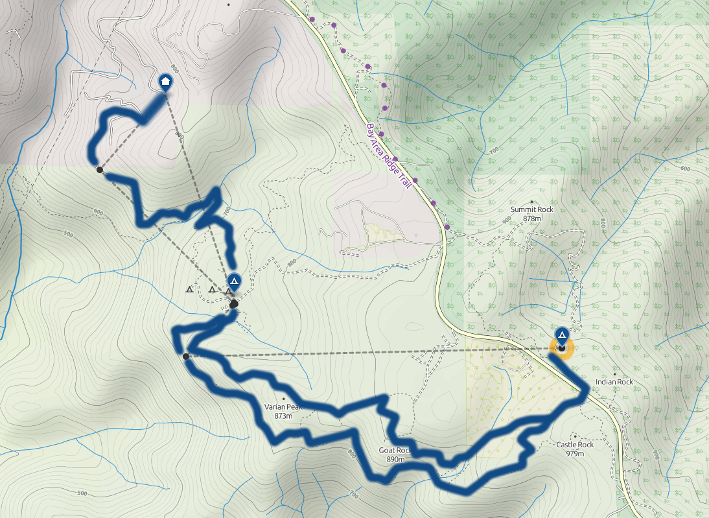

Title: Castle Rock State Park Training
Date: March 7, 2015
Category: Training

    
    

        Training hike at Castle Rock State Park
    

Friday was my last day at work which means it's time to start my **official** training.  A friend and I headed up to my favorite hiking spot in the area at Castle Rock State Park.  Our goal was to hike 10 miles with our packs loaded while keeping our pace in mind.  We'd like to be comfortable hiking around 2.5 miles per hour on the trail.

I wore my REI long sleeved sun shirt that I planned on wearing at the start of the trail.  Unfortunately, there are a couple seams that give me pretty bad pack rash so I'll have to start thinking about alternatives.

The tree cover at Castle Rock gave me good chance to test my Spot GPS beacon.  If everything is working, the device should send out a message every 10 minutes.  It looks like it had trouble picking up signal in a few spots as there are a few markers missing from the map.  This wasn't too surprising as I'd seen this mentioned in reviews before.  I'm still happy with the amount that gets through, though.

I was also able to play with the special messages I can send from the Spot.  I have it setup to display a tent icon or a home icon which I plan to use when I'm at a camp site or in town.

In order to stretch our hike out longer than the established trail, we had to add a side route through a residential area.  We didn't realize just how residential it was so we cut our walk short and only made it through 8 miles.  Other than a few hiccups, it was a gorgeous day.

    
    

        Training hike map
    

