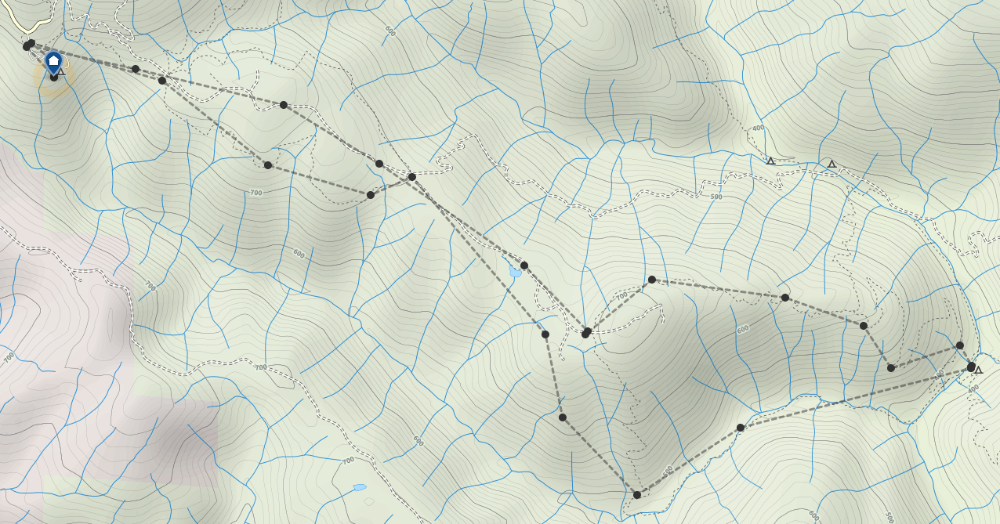

Title: Henry Coe State Park Training
Date: March 14, 2015
Category: Training

    
    

        A gorgeous day at Henry Coe State Park
    

It feels like a long time since the local parks have allowed campfires because of the majorly dry conditions we've had, but those times are over for now.  Henry Coe State Park lifted their fire restrictions a few weeks ago which meant it was smores time!  To negate the campfire treats, we figured a hike was also in order.

    
    

        Henry Coe State Park hike map
    

The forecast showed a high of 80° and clear skys so we loaded our packs full of water and set out for an 11 mile loop.  Last time we hiked this trail, it was the middle of summer and bone dry.  Thankfully, the bit of rain we've had left the creeks flowing and the swimming holes full.  It was a huge relief to see China Hole full and we knew we had to at least dip our feet in.

    
    

        China Hole has water!
    

The [pack rash]({filename}/training-crsp.md) that was bothering me last weekend was still acting up which gave me a chance to test out one of my blister/chafe prevention plans: **leukotape**.  In the past, I've tried both duct tape and moleskin for this application, but I've found they both eventually fall off because of sweat.  Leukotape is a rayon based tape with an extremely strong adhesive often used for kinesio taping.  It's also breathable which is really useful for blisters.

	

Over the course of the hike on Saturday, a full game of soccer on Sunday, and a day of running errands on Monday, this stuff held up really well and could've gone longer.  I had to be very careful when peeling the tape off to not take skin with it.  I'm definately bringing a few yards of this with me on the trail and putting the rest of the roll in my bounce box.

I also got a chance to really test out my sun umbrella.  Believe it or not, it works just like any other umbrella would.  I really enjoyed being able to take my hat off and let my head breath while I was walking.  It was also great for blocking out the sun during our breaks.  I can see how this will come in handy, especially in the desert.

    
    

        Sunset at Henry Coe State Park
    

